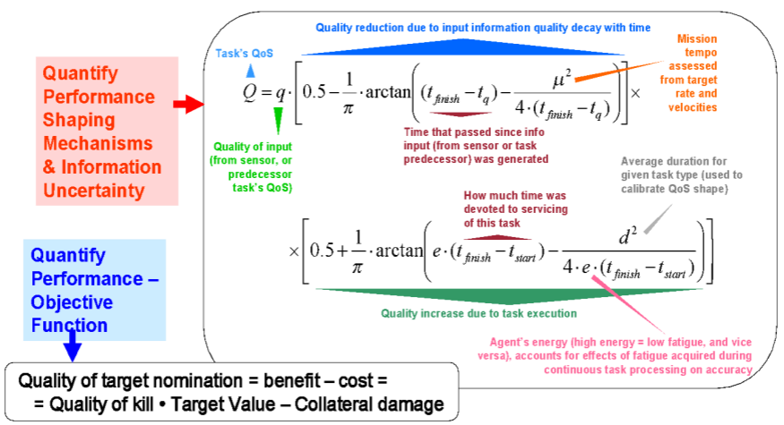

<div align="center">
  
  **[:arrow_left: Previous Section][Prev] | [Table of Contents][TOC] | [Next Section :arrow_right:][Next]**
  
  [Prev]: /expose/03-0.md
  [Next]: /expose/05-0.md
  [TOC]: /README.md#table-of-contents
  
</div>

---

## 4. Misuse and Abuse of Defense Systems Developed via Universities, in Committing Genocides 

As if the international-scale issue of stolen IP, as discussed in the previous section, wasn't problematic enough, here is the heart of the issue, that involves the use of technologies and systems **misappropriated** via North American universities. Such illegitimately obtained technologies have continued to be utilized for killing civilians, en mass, across international borders within various regions of the world, by US-led groups and organizations: 

>**Illegally developed or obtained systems for aviation, surveillance, and weaponry — being sold or used by US-led groups across international waters, for the purposes of carrying out activities that deliberately and forcefully cause mass civilian casualties, and mutilations, is the essence of this long-standing issue.**

Let us now look at the details contained within R&D files that demonstrate the "intentionality and premeditation" behind the mass murders of civilians, committed by US-led groups. 

1. One of the projects (a Blue Sky Project) I had worked on, and contributed to via UIowa, involved producing designs and mechanisms for improving the functionality of both manned and unmanned vehicles, which were, and are currently designated as Early Warning And Combat Systems (EWACS). The project mainly focused on research into root-cause analysis of drone mission failures, as well as improvement of the artificial intelligence (AI) components used in programming EWACS automation.

    1. Is this true? Yes it is, and the physical evidence within the R&D materials I had worked on, with my colleagues in UIowa that prove it as such, is included here: [long-overdue-justice/reference/files](../reference/files). The included evidence is provided as encrypted files to protect them from improper access and misuse by illegitimate entities. 
  
1. Are the given materials sworn to be authentic? Yes, these are truthful and genuine R&D files, from the work I did in UIowa during 2007 - 2008, that are being provided here under an oath of fidelity. The R&D files contained in the given folder cannot be fabricated or somehow counterfeit, without being detectable via digital forensics as having been doctored. Moreover, copies of the given R&D files, as well as the subsequent files produced from it, with production and deployment phase data, might still be available in archives of DARPA projects with responsible custodians of those US government archives. 

1. Do the provided files contain state-secrets? They <ins>do not</ins> contain state-secrets or classified documents. Project summary and detailed reports involving those materials were published within masters and doctoral theses, and also as publicly available research papers, by members of the Cognitive Systems Laboratory (CSL). CSL was a part of the Industrial Engineering Department, and was affiliated with the Center for Computer Aided Design (CCAD), at UIowa. Regarding the given files, the US government's Department of State (US-DOS), the Department of Justice (US-DOJ), and the Department of Defense (US-DOD), might agree with the fact that the provided files were never classified as secrets; however, they might nonetheless assert that the private and confidential nature of those files, have thus been breached via the disclosure of excerpts from them, in order to draw attention away from the probative nature of such disclosed materials in matters concerning mass murders committed through the use of autonomous, and semi-autonomous vehicles. 

    1. One may eventually come to observe that: serial killings of non-combatants and even those of friendly soldiers in foreign territories during war-times, involving intentional "drive-by shootings," or a "hit-and-run," through the use of any manned or unmanned vehicles which, also generate a large number of casualties, are tantamount to, *"multiple counts of vehicular manslaughter in the first degree, with mass civilian casualties, committed across international borders,"* under the cover of warfare. 

    1. Of course, the premeditated nature of any vehicular assaults with large-scale destruction of civilian lives and properties, makes those acts of violence, a particularly aggravated form of serial mass murders. 

    1. Even after admitting to the above two points, a variety of government agencies from several countries might still disapprove of, and disagree with my objectives in disclosing such materials on a publicly accessible online repository. They may even want to discredit me as well as this documentation, in every way possible, because analysis of the given files can reveal certain activities of US Navy and coalition soldiers, which are claimed here as being willful contributions of US-led R&D groups to a certain set of war crimes, committed by US-led entities, during the past two decades. 

1. Shouldn't locations and activities of soldiers, and that of their suppliers and contractors, be protected with secrecy as well as confidentiality, and not be readily disclosed to the international community, even if that type of data is not categorized or classified as secrets? Quite understandably, yes they ought to be kept confidential, but when such R&D materials are vital to discussing belligerent human rights violations and mass murders, then secrecy and confidentiality cannot be allowed to become an integral part of the state-sponsored mechanisms, which cause grievous violations, thefts of properties, serial mass murders, as well as mass civilian casualties across international borders.

1. The image shown in **Figure 1,** is from the drone R&D document titled, *"Optimized Planning and Tasking for the Intelligent Management of Unmanned Aerial Vehicles"* ( i.e. ["/reference/files/Task Allocation - v9.doc.pgp"](../reference/files/UAV%20Task%20Allocation%20-%20v9.doc.pgp)). 

    <p align="center">
      </img>
      <br>
      <strong>Figure 1 -</strong> "Quantifying objective functions and performance shaping mechanisms" quoted here from documents of the DARPA project titled, <em>"Optimized Planning and Tasking for the Intelligent Management of Unmanned Aerial Vehicles."</em>
    </p>

    1. The above-shown figure needs to be disclosed in this documentary, for explaining the type of malfeasance that has led to hundreds of US-led soldiers, and thousands of Middle-Eastern civilians being killed from drone based missile attacks. And this is merely one example of the numerous technical faults and errors among existing EWACS, that are being sold and used by US-led groups.
    
    1. **Figure 1** illustrates the internal workings of the kind of AI (the neural network based software program) that operates particular multi-purpose military drones. It also demonstrates the thought process and rationales of R&D engineers and managers, who come up with so-called "objective cost functions," for evaluating the value of kills performed by automated war-machines. 

        1. Such a cost to the military in successfully attacking a target using pre-programmed drones, as shown in this particular example, was labeled as *"Quality of target nomination (Q)."*
  
        1. Civilians injured or killed, along with civilian properties damaged or destroyed by drone strikes, were collectively labeled as *"Collateral Damage,"* which were given subjectively made up negative points with a complex, weighting factor.
  
        1. Military targets correctly disabled or destroyed by drone based activity, were given subjectively made up positive points termed as, *"'Quality of Kill' multiplied by 'Value of Kill.'"* And this made up mathematical term was associated with its, complex, weighting factor.
  
        1. "*Q*" was then calculated as the algebraic sum of the above two mathematical terms, in the form of numerical points, for driving the neural network algorithms of the drones' AI.

    1. Such a machine learning and neural network based approach is indeed illegitimate, dangerous, and woefully wretched because:
  
        1. The moral and ethical ramifications of injuring or killing civilians, and destroying civilian properties, could not, and still cannot be quantified into machine readable arithmetic. 
    
        1. **Persons such as supervisors, engineers and technicians who program the AI, typically, incorrectly categorize instances of civilian deaths as well as collateral damage, within drone training data, as valid military targets.** Moreover, combining the concepts of human lives lost due to targeted attacks with a variety of destruction to physical properties is a logical error. Such a logical error only masks and hides the true number of lost and mutilated human lives. 
    
        1. The scaling factor, or weighting factor, ascribed to the combined value of civilian deaths and collateral damage, can be manually tuned, and manipulated, to make it less than the numeric value assigned to valid military targets. This form of cheating within the software codes and assessment reports, allows engineers and project owners to **always obtain a positive value for:**

            >**benefit** (assumed numerical value of a valid hit on an actual military target), **minus**, **cost** (assumed numerical value as a combined sum of civilian casualties, injured or maimed individuals, and destroyed or damaged civilian properties). 
  
        1. The death and destruction caused during the course of training autonomous war-machines, is already a form of irreparable damage that remains unaccounted for by drone operators and developers.
    
        1. But even the above mentioned hapless method of distinguishing between civilian and non-civilian targets was cast aside — to give the drones full reign on automatically shooting and destroying anything resembling humans, housing, or vehicles within manually programmed geographic areas. Those geographic areas spanned thousands of square miles encompassing distant, and unconnected, civilian towns and villages. 
    
        1. The number of human mistakes and violations committed throughout R&D and sales of autonomous war-machines, only keep compounding and getting worse, due to the global-scale and industrial strength of drone based military operations.

    1. It is simply true, that increasing the efficiency of an automated system, which also sells well as an engineered product for killing and destroying targets over larger geographical areas, has remained the main developmental goal of US-led R&D groups. And such an overall pecuniary motivation gets repeatedly prioritized — above all needs for adhering to internationally accepted norms, concerning humane and ethical treatment of innocent civilians and bystanders. 
  
So, some of you who are reading this, might have already come to realize that, if the primary objective and design of any R&D group, or a militarized regime, is to deliberately commit genocides, then the efficiency of such drone based methods in doing so, is second only to bio-weapons, in terms of ***"costs per kill."***

---

```
Abbreviations:
AI     - Artificial Intelligence
CCAD   - Center for Computer Aided Design (University of Iowa, USA)
CSL    - Cognitive Systems Library (University of Iowa, USA)
DARPA  - Defense Advanced Research Projects Agency (USA)
EWACS  - Early Warning And Combat Systems
IP     - Intellectual Property (or Intellectual Properties)
R&D    - Research and Development
UIowa  - The University of Iowa
UK     - United Kingdom
US     - United States (of America)
US-DOD - US Department of Defense
US-DOJ - US Department of Justice
US-DOS - US Department of State
```

---

<div align="center">
  
  **[:arrow_left: Previous Section][Prev] | [Top :arrow_up:][Top] | [Next Section :arrow_right:][Next]** 
  
  **[Table of Content][TOC]**

  [Prev]: /expose/03-0.md
  [Top]: /expose/04-0.md#4-misuse-and-abuse-of-defense-systems-developed-via-universities-in-committing-genocides
  [Next]: /expose/05-0.md
  [TOC]: /README.md#table-of-contents
  
</div>
