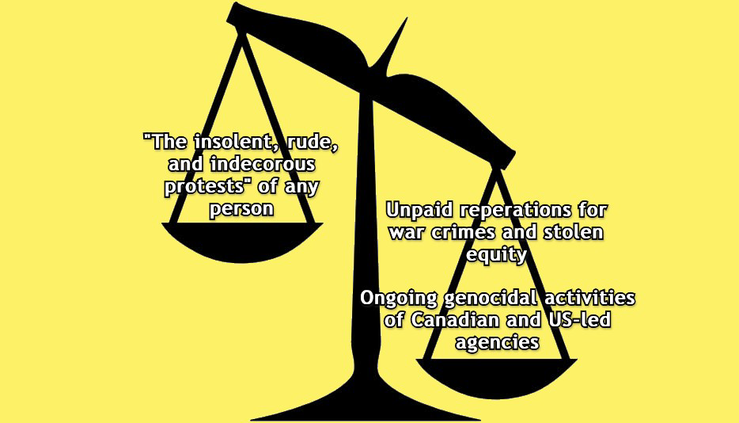

<div align="center">
  
  **[:arrow_left: Previous Section][Prev] | [Table of Contents][TOC] | [Next Section :arrow_right:][Next]**
  
  [Prev]: /expose/12-0.md
  [Next]: /expose/14-0.md
  [TOC]: /README.md#table-of-contents
  
</div>

## 13. LSO's Involvement in Protecting Canadian Threat Actors

Canada has not had the decency, nor the discipline, to honestly pay reparations to victims and survivors of genocides and human rights violations, committed by its state-sponsored agencies, religious organizations, public service units, and authority figures. This inglorious fact cannot be hidden by any of the dishonorable cover ups and indemnities shored up by entities like Canada's Defense Ministry, or the Law Society of Ontario (LSO).

The only reason my family and I were put through devastating and ruinous harms, was because of the types of immunity and indemnities Canadian state-sponsored threat actors, and its public as well as private agencies have given themselves via entities like LSO. Those agencies and their authorized agents continue to commit serial acts of thefts, fraudulence, malpractices, inequitable treatment, harassment, abductions, and murders with genocidal intentions, while pretending to be placid, international vanguards of basic human rights and civil liberties. Any evidence of their crimes is not even allowed to appear in a court because of the dastardly tactics deployed by persons affiliated with the LSO, or with the judiciary and legislative systems in Canada.

How dare the so-called Justices of The Peace issue any kind of writs, while aiding organized crimes of genocidal nature?

Shame on you Canada! Shame on you!

<div align="center">
  </img>
  <br>
  <b>The imbalance is plainly evident and apparent!</b>
</div>

<br>

Every wretched excuse and delay adopted via policies, protocols, and practices of organizations like the LSO which cause attrition to already suffering individuals, is only an added violation committed by Canada, and a deplorable insult to injury thrust upon victims and survivors of state-sponsored injustices. 

In this situation, Canada does not have the right to implement any kind of "statutes of limitation", judgments in rem, or any kind of judgments in absentia of survivors, because it has continued to violate the basic human rights of snared people from the international community in discriminatory and targeted ways. 

Would any living persons like to claim that the allegations made in these documents are wild and baseless? With which kind of an authority, and with which face that can be shown to the public, can they possibly attempt to defend Canadian threat actors against the facts presented in this documentation? Canada's sordid and rancorous violations against human ecology, indigenous and First Nations peoples, ethnic minorities, and marginalized groups have continued unabated for decades on a daily basis, and they cannot be allowed to continue any longer! 

Canada's unwillingness to dutifully pay reparations, and inability to provide satisfactory justice to wronged peoples and individuals, is because it lacks the required rectitude and righteousness to do so. 

The abhorrent and disrespectful deeds of Canada's key institutions is an affront to all of nature, humanity, and even to future generations of human beings, for they will only come to suffer because of the inter-generational harms propagated by Canada's fiduciary agencies, and by the vested officers of its private organizations and public service entities.  

Shame on you Canada! Shame on you!

---

```
Abbreviations:
LSO - Law Society of Ontario
```

---

<div align="center">
  
  **[:arrow_left: Previous Section][Prev] | [Top :arrow_up:][Top] | [Next Section :arrow_right:][Next]** 
  
  **[Table of Content][TOC]**

  [Prev]: /expose/12-0.md
  [Top]: /expose/13-0.md#13-lsos-involvement-in-protecting-canadian-threat-actors
  [Next]: /expose/14-0.md
  [TOC]: /README.md#table-of-contents
  
</div>